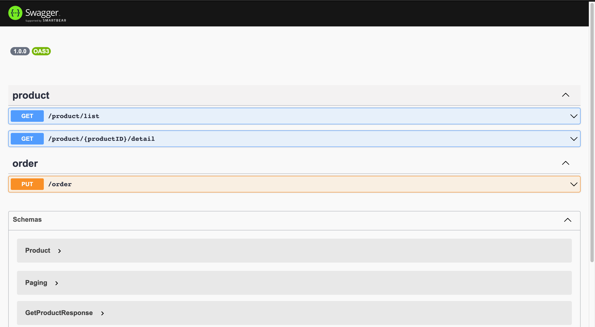
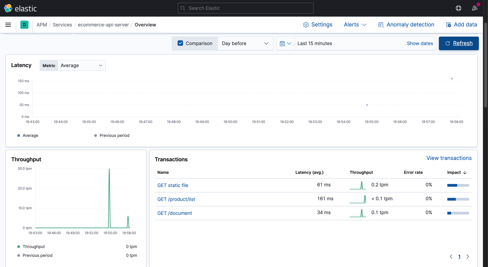

### ECommerce-Platform

#### About The Project

- A simple api service build on [NestJS](https://nestjs.com)
- Use [Elastic APM](https://www.elastic.co/apm) as log service
- Manage Document by [Swagger UI](https://swagger.io/tools/swagger-ui/)

#### Get started

```
# deploy service
$ docker-compose -f docker/docker-compose.yaml up -d

# rebuild api service
$ docker-compose -f docker/docker-compose.yaml build api-server
```

#### Get Document Here

```

http://localhost:3000/document/#/

```



#### Get Log Here

```

http://localhost:5601/app/apm/services

```



#### Try out API

> ##### Get Product List
>
> ```
> curl -X GET \
>   'http://localhost:3000/product/list?limit=10&> offset=0' \
>   -H 'Host: localhost:3000'
> ```
>
> ##### Get Product Detail
>
> ```
> curl -X GET \
>   'http://localhost:3000/product/1/detail' \
>   -H 'Host: localhost:3000'
> ```
>
> ##### Create Order
>
> ```
> curl -X PUT \
> http://localhost:3000/order \
> -H 'Content-Type: application/json' \
> -H 'Host: localhost:3000' \
> -H 'x-user-session: b61c9a51-b750-4353-a0f2-faaa1a1d8431' \
> -d '{
>   "productList": [
>     {
>       "productID": 1,
>       "quantity": 2
>     },
>     {
>       "productID": 2,
>       "quantity": 3
>     }
>   ]
> }'
> ```
